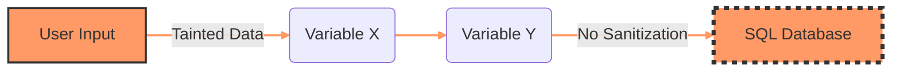
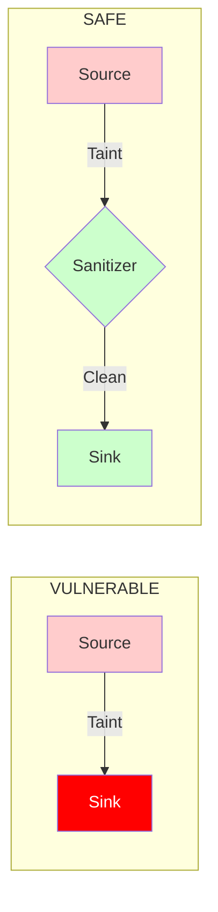
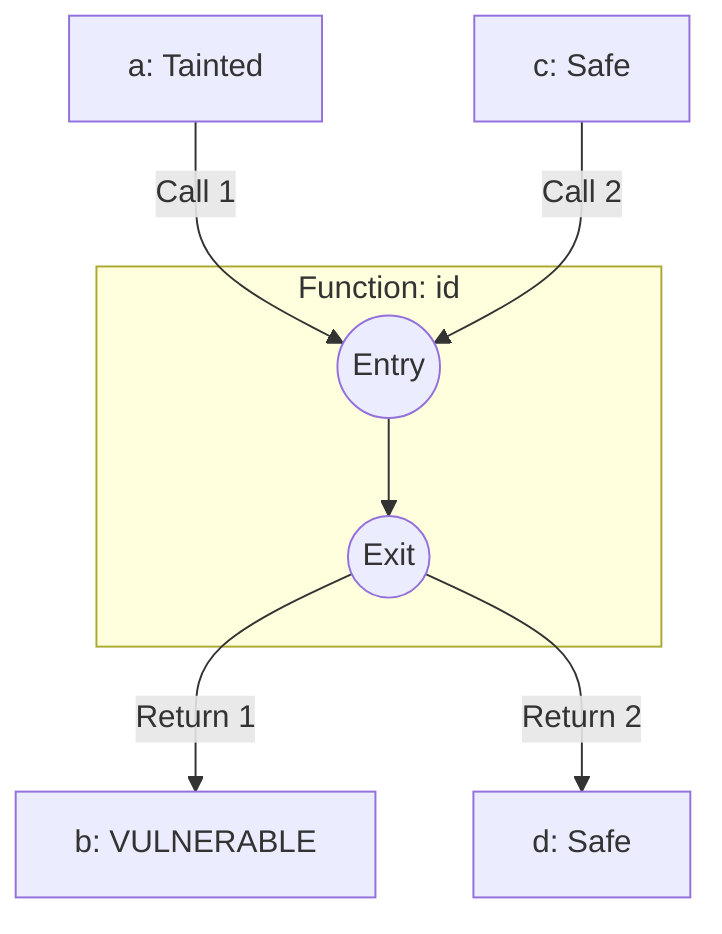
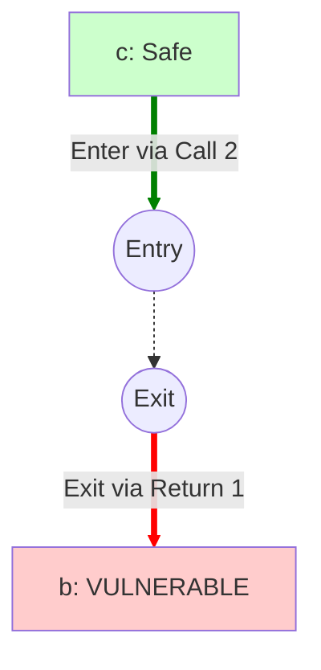
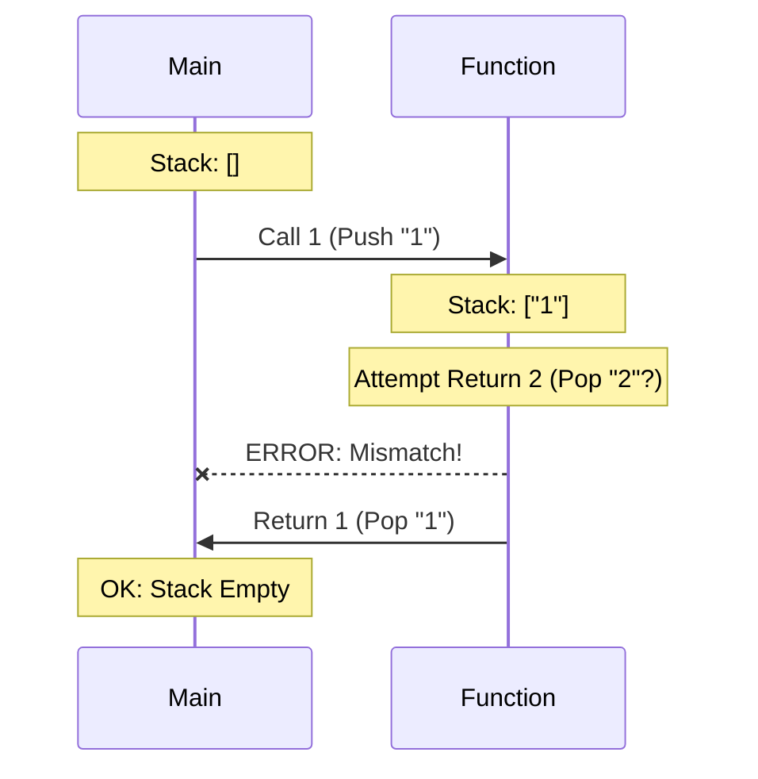
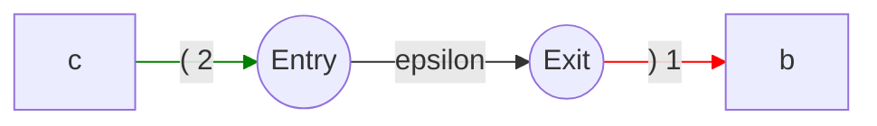
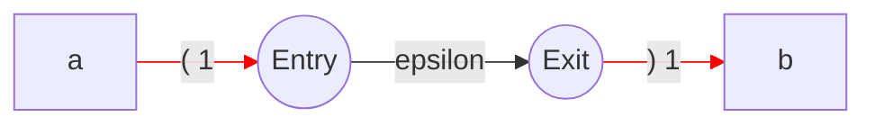
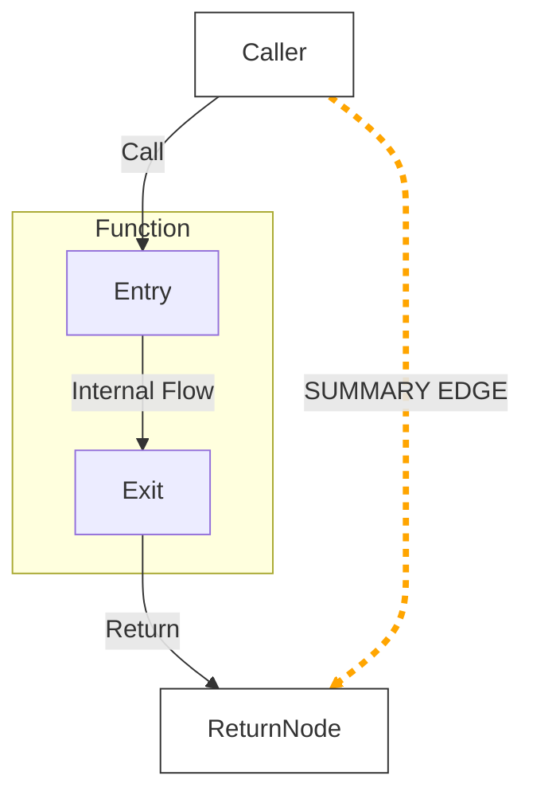

---

# **Taint Analysis using CFL-Reachability**
### Bridging Formal Language Theory and Software Security

---

# **Agenda**

1.  **Foundations**: Taint Analysis & Security
2.  **The Challenge**: Interprocedural Analysis & The "Context" Problem
3.  **The Theory**: Context-Free Languages & Dyck Paths
4.  **The Solution**: CFL-Reachability Framework
5.  **Algorithms**: Complexity & Solving
6.  **Conclusion**

---

# **Part I: Foundations**
## Understanding Taint Analysis

---

# **What is Taint Analysis?**

* **Definition**: A form of information-flow analysis.
* **Goal**: Determine if an untrusted user input can affect the execution of a sensitive function.
* **The Metaphor**: Dye in a water pipe.
    * **Red Dye (Source)**: User input.
    * **Pipe (Program)**: Variables and functions.
    * **Faucet (Sink)**: Sensitive execution.

---

# **The Vulnerability Equation**

A vulnerability exists if and only if:

1.  $\exists$ Path $p$ from **Source** to **Sink**.
2.  $\nexists$ **Sanitizer** $s$ on path $p$.

---

# **Part II: The Challenge**
## Graph Reachability & Interprocedural Analysis

---

# **The "Context" Problem**

Consider two calls to the same function `id(x)`.

1.  `a = source()` (Tainted) calls `id(a)`
2.  `c = "safe"` (Clean) calls `id(c)`

**The Ambiguity:**
Inside the function `id(x)`, we lose track of *which* call site invoked us.

---

# **Naive Reachability: The "Unrealizable" Path**

Standard graph traversal (BFS/DFS) ignores call history. It creates a **False Positive** by "crossing over" inside the function.

**The Invalid Path (False Positive):**
`c (Safe)` $\to$ `Entry` $\to$ `Exit` $\to$ `b (Vulnerable)`

*This path is physically impossible in code execution, but "reachable" in a standard graph.*

---

# **Part III: The Theory**
## Context-Free Languages (CFL)

---

# **Visualizing the Call Stack**

We need to enforce "Matched Parentheses".
* Call 1 = Open `(`
* Return 1 = Close `)`

**Rule**: You can only close the parenthesis that is currently open at the top of the stack.

---

# **The Dyck Language ($D_k$)**

This is formally modeled using the **Dyck Language** (language of balanced brackets).

* **Alphabet**: $\Sigma = \{ (_{1}, )_{1}, (_{2}, )_{2}, ... \}$
* **Grammar**: $S \to (_{i} S )_{i}$

**CFL-Reachability Definition:**
Node $v$ is reachable from node $u$ iff there exists a path $p$ such that the string of edge labels along $p$ forms a valid word in the language $L$.

$$Word(p) \in L$$

---

# **Part IV: The Solution**
## Filtering Paths with CFL

---

# **Edge Labeling Strategy**

We construct a labeled graph where edges represent stack operations:

| Edge Type | Label | Meaning |
| :--- | :--- | :--- |
| **Call Edge** | $(_i$ | "Push context $i$" |
| **Return Edge** | $)_i$ | "Pop context $i$" |
| **Local Flow** | $\epsilon$ | "No context change" |

---

# **Solving the Identity Example**

Let's re-examine the **False Positive** path with labels.

1.  **Path String**: $(_2 \ \epsilon \ )_1$
2.  **Parser Check**: Does `(2 )1` match?
3.  **Verdict**: **NO**. Mismatched Parentheses.
4.  **Result**: Path Rejected. False Positive Eliminated.

---

# **Solving the Valid Taint Path**

Now, the **True Positive** path.

1.  **Path String**: $(_1 \ \epsilon \ )_1$
2.  **Parser Check**: Does `(1 )1` match?
3.  **Verdict**: **YES**.
4.  **Result**: Path Accepted. **Vulnerability Reported.**

---

# **Part V: Algorithms**
## Complexity & Summaries

---

# **Summary Edges (The Optimization)**

To avoid re-analyzing functions, we add "Summary Edges".
* If we confirm `Entry` $\to$ `Exit` is valid...
* We add a direct edge from Caller to Return.

*We "short-circuit" the traversal using the orange path.*

---

# **Complexity Comparison**

The cost of precision is computational time.

| Feature | Naive Reachability | CFL-Reachability |
| :--- | :--- | :--- |
| **Context Sensitivity** | No | Yes |
| **Path Validity** | Ignores mismatch | Enforces balance |
| **Complexity** | $O(N)$ (Linear) | $O(N^3)$ (Cubic) |
| **Best For** | Quick Scans | Deep Audit |

---

# **Part VI: Conclusion**

---

# **Summary**

1.  **Code** is a graph, but **Execution** is a stack.
2.  **Naive Analysis** fails because it treats code as a flat graph.
3.  **CFL-Reachability** combines the Graph and the Stack using Formal Language Theory.
4.  It ensures we only flag **Realizable Paths**, drastically reducing False Positives.

---

# **Final Thought**

> "We are not just looking for connections in a graph. We are looking for **grammatically correct stories** of how data moves through code."

### References
1.  *Reps, T. (1998). "Program analysis via graph reachability".*
2.  *Soot Framework (Java Analysis)*
3.  *WALA (IBM T.J. Watson Libraries)*

---