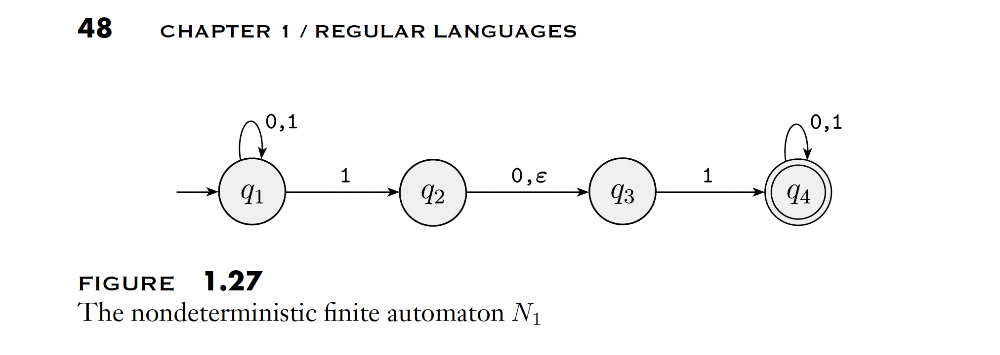

# NFA (Nondeterministic Finite Automaton) Implementation

A generic Java implementation of Nondeterministic Finite Automata that supports epsilon (ε) transitions and converts to equivalent DFAs for acceptance testing.

## Overview

This library implements NFAs with the following features:
- **Nondeterministic transitions**: Multiple transitions possible from a single state on the same input
- **Epsilon transitions**: State transitions without consuming input symbols
- **NFA to DFA conversion**: Automatic conversion using the subset construction algorithm
- **Type-safe API**: Uses Java generics and enums for compile-time safety

## Requirements

- Java 21
- Maven 3.x
- Google Guava library (for power set operations)

## Installation

Build the project using Maven:

```bash
mvn clean install
```

## Example: Figure 1.27 from Sipser

This implementation includes the NFA N₁ from Figure 1.27 (Sipser, page 48), which accepts strings containing "101" or "11" as substrings.



### NFA Definition

**States**: {q1, q2, q3, q4}
**Alphabet**: {0, 1}
**Start state**: q1
**Accept state**: q4

**Transitions**:
- q1 on {0,1} → q1 (self-loop)
- q1 on 1 → q2
- q2 on 0 → q3
- q2 on ε → q3
- q3 on 1 → q4
- q4 on {0,1} → q4 (self-loop)

### Implementation

```java
// Define states and alphabet
enum State { Q1, Q2, Q3, Q4 }
enum BinarySymbol { ZERO, ONE }

// Create transition function with epsilon transitions
BiFunction<State, Optional<BinarySymbol>, Set<State>> transitionFunction =
    (state, symbol) -> {
        Set<State> result = new HashSet<>();

        switch (state) {
            case Q1:
                if (symbol.isPresent()) {
                    result.add(State.Q1);  // Self-loop on 0,1
                    if (symbol.get() == BinarySymbol.ONE) {
                        result.add(State.Q2);  // Transition to Q2 on 1
                    }
                }
                break;

            case Q2:
                if (symbol.isEmpty()) {
                    result.add(State.Q3);  // Epsilon transition
                } else if (symbol.get() == BinarySymbol.ZERO) {
                    result.add(State.Q3);  // Transition on 0
                }
                break;

            case Q3:
                if (symbol.isPresent() && symbol.get() == BinarySymbol.ONE) {
                    result.add(State.Q4);  // Transition on 1
                }
                break;

            case Q4:
                if (symbol.isPresent()) {
                    result.add(State.Q4);  // Self-loop on 0,1
                }
                break;
        }

        return result;
    };

// Build the NFA
Nfa<State, BinarySymbol> nfa = new NfaImpl<State, BinarySymbol>().build(
    Set.of(State.Q1, State.Q2, State.Q3, State.Q4),  // states
    Set.of(BinarySymbol.ZERO, BinarySymbol.ONE),     // alphabet
    transitionFunction,                               // transition function
    State.Q1,                                        // start state
    Set.of(State.Q4)                                 // accept states
);

// Test the NFA
List<BinarySymbol> input1 = Arrays.asList(BinarySymbol.ONE, BinarySymbol.ZERO, BinarySymbol.ONE);
boolean accepts1 = nfa.accepts(input1);  // true - contains "101"

List<BinarySymbol> input2 = Arrays.asList(BinarySymbol.ONE, BinarySymbol.ONE);
boolean accepts2 = nfa.accepts(input2);  // true - contains "11" (via epsilon)

List<BinarySymbol> input3 = Arrays.asList(BinarySymbol.ZERO, BinarySymbol.ONE, BinarySymbol.ZERO);
boolean accepts3 = nfa.accepts(input3);  // false - doesn't contain pattern
```

## How It Works

### NFA Acceptance

The `NfaImpl.accepts()` method works by:
1. Converting the NFA to an equivalent DFA using the subset construction algorithm
2. Running the input through the equivalent DFA
3. Returning the DFA's acceptance result

### Epsilon Closure

The implementation computes epsilon closures using a stack-based algorithm:
- Start with the current state
- Follow all epsilon transitions to find reachable states
- Return the complete set of states reachable via epsilon transitions

### NFA to DFA Conversion

The subset construction algorithm:
1. **States**: Power set of NFA states
2. **Start state**: Epsilon closure of NFA's start state
3. **Transitions**: For each subset and symbol, compute the union of epsilon closures of all reachable states
4. **Accept states**: All subsets containing at least one NFA accept state

## API Reference

### Nfa Interface

```java
public interface Nfa<STATE, SYMBOL extends Enum<SYMBOL>> {
    Nfa<?, ?> build(
        Set<STATE> states,
        Set<SYMBOL> alphabet,
        BiFunction<STATE, Optional<SYMBOL>, Set<STATE>> transitionFunction,
        STATE startState,
        Set<STATE> acceptStates
    );

    boolean accepts(List<SYMBOL> input);

    Dfa<Set<STATE>, SYMBOL> equivalentDfa();
}
```

### Key Methods

- **`build(...)`**: Constructs an NFA with the specified components
  - `states`: Set of all possible states
  - `alphabet`: Set of all possible input symbols
  - `transitionFunction`: Function mapping (state, Optional<symbol>) to set of states
    - `Optional.empty()` represents epsilon (ε) transitions
  - `startState`: Initial state
  - `acceptStates`: Set of accepting states

- **`accepts(List<SYMBOL> input)`**: Tests whether the NFA accepts the given input

- **`equivalentDfa()`**: Returns the equivalent DFA using subset construction

## Project Structure

```
src/
├── main/java/com/github/mostafaism1/dfa/
│   ├── Nfa.java          # NFA interface
│   ├── NfaImpl.java      # NFA implementation
│   ├── Dfa.java          # DFA interface (used for conversion)
│   └── DfaImpl.java      # DFA implementation
└── test/java/com/github/mostafaism1/dfa/
    ├── NfaTest.java      # Acceptance tests for Figure 1.27
    └── DfaTest.java      # DFA tests
docs/
└── images/
    └── figure-1-27-nfa.png   # NFA diagram from Sipser
```

## Testing

Run the test suite:

```bash
mvn test
```

Run only NFA tests:

```bash
mvn test -Dtest=NfaTest
```

The test suite (`NfaTest.java`) includes 16 comprehensive acceptance tests for the NFA from Figure 1.27:
- 9 tests for strings that should be accepted (containing "101" or "11")
- 7 tests for strings that should be rejected

### Example Test Cases

**Accepted strings**:
- "101" - Basic pattern
- "11" - Pattern via epsilon transition
- "00101" - Pattern with prefix
- "10100" - Pattern with suffix

**Rejected strings**:
- "" - Empty string
- "10" - Incomplete pattern
- "1010" - Doesn't end in accept state
- "000" - No pattern present

## Implementation Notes

- The NFA uses `Optional<SYMBOL>` in the transition function to distinguish between epsilon (`Optional.empty()`) and regular symbol transitions (`Optional.of(symbol)`)
